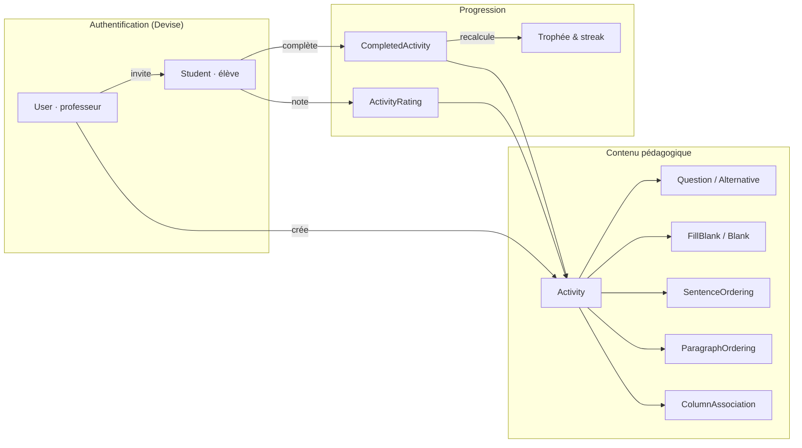

<p align="center">
  
</p>

<p align="center">
  <strong>Une application Rails complète pour apprendre le français</strong><br>
  Créée par une professeure, construite par une développeuse — en production, avec de vrais élèves.
</p>

<h3 align="center"><a href="https://github.com/DaisyOli/Practice-FR">Practice FR</a></h3>

<p align="center">
  <a href="https://github.com/DaisyOli/practice-fr/actions/workflows/ci.yml"></a>
  
  
  
  
  <a href="https://practicefr.com"></a>
</p>

<p align="center">
  🇫🇷 Français · <a href="README.md">🇬🇧 English</a>
</p>

---

## L'idée

**Practice FR** est une plateforme où des professeurs de français créent des activités interactives (QCM, textes à trous, ordre de phrases, associations) et suivent la progression de leurs élèves — streaks, niveaux CECR, et attestations de formation prêtes pour les dossiers de financement OPCO / CPF.

Ce n'est pas un projet-vitrine : c'est une application **en production** (Heroku, [practicefr.com](https://practicefr.com)) qui sert de vrais professeurs et de vrais élèves, avec tout ce que ça implique — limites anti-timeout, traitement asynchrone, rate limiting, health checks, audit log admin.

## Ce qui rend ce projet intéressant

### 🎮 La gamification a un vrai concept, pas juste une barre de progression
Chaque jour consécutif d'entraînement rapproche l'élève d'un trophée à thème français — codé comme une vraie règle métier dans `Student#current_trophy`, pas un plugin générique :

`🎯 Débutant → 🥐 Croissant (3j) → 🥖 Baguette (7j) → 🧀 Fromage (14j) → 🍷 Vin (30j) → 🗼 Tour Eiffel (60j+)`

### 📜 Attestations de formation pensées pour les financements OPCO / CPF
Un élève financé par l'OPCO de son employeur ou via son CPF doit justifier ses heures de formation. Practice FR gère ça de bout en bout : le professeur marque le parcours de financement (OPCO / eCPF) dès l'invitation, un badge dédié suit l'élève dans toute l'application, et un clic génère une **attestation de formation imprimable** dont les heures sont calculées à partir du temps de pratique réellement mesuré (de l'ouverture à la fin de l'activité, plafonné par tentative) — pas déclarées à la main. C'est ce document qui permet au professeur d'accueillir des élèves financés.

### 🏗️ Architecture "franchise" — un design system, deux marques
Ce dépôt partage un **contrat de design** avec son application sœur en portugais (Practice BR) : mêmes noms de tokens CSS (`--brand`, `--ink`, `--paper`…), même anatomie de composants, seules les valeurs de palette changent. La règle d'or — *jamais un hex brut dans une vue, toujours `var(--token)`* — est documentée et appliquée dans tout le code (`docs/DESIGN_SYSTEM.md`). Résultat : une vue écrite pour un des deux apps fonctionne dans l'autre sans modification structurelle.

### 📚 Les types d'exercices sont des modèles métier, pas du JSON générique
QCM, texte à trous, ordre de phrases/paragraphes et association de colonnes sont chacun leur propre modèle ActiveRecord (`fill_blank.rb`, `sentence_ordering.rb`, `column_association.rb`…), avec leurs propres validations, leur ordre d'affichage et leurs propres contrôleurs imbriqués — pas une colonne `type` fourre-tout.

### 🛡️ Pensé pour la production, pas seulement pour "marcher en local"
- Limite de 25 questions par activité + traitement **asynchrone par lots** pour les grosses activités, avec notification par email à la fin
- `Rack::Timeout` avec middleware dédié pour les requêtes lourdes liées aux activités
- `Rack::Attack` pour le rate limiting
- Endpoint `/health` qui vérifie réellement PostgreSQL **et** Redis, pas un simple `200 OK`
- Panneau d'administration avec **journal d'audit** (`AdminAuditLog`) pour chaque action sensible (suppression de compte, changement de niveau…)

## Fonctionnalités

| | |
|---|---|
| 🔑 **Double authentification** | Devise pour les professeurs, Devise pour les élèves (`Student`), sessions et permissions séparées |
| ✉️ **Invitations par email** | `devise_invitable` — le professeur invite, l'élève accepte et choisit son mot de passe |
| 📈 **Niveaux CECR (A1 → C2)** | Accès cumulatif : un élève de niveau B1 voit A1, A2 et B1 |
| 🔥 **Streaks & trophées** | Suivi quotidien, meilleur streak, message motivant en français |
| 📊 **Tableau de bord professeur** | Liste des élèves, score moyen, dernière activité, temps d'entraînement |
| 📜 **Attestations de formation** | Badge OPCO / eCPF par élève + attestation imprimable, heures calculées sur le temps de pratique mesuré — le justificatif attendu par les financeurs |
| ⭐ **Notation des activités** | Les élèves évaluent les activités qu'ils complètent |
| 🛠️ **Panneau admin** | Vue d'ensemble multi-professeurs + journal d'audit des actions |

## Architecture



## Stack technique

**Backend** — Ruby 3.3.5 · Rails 7.1 · PostgreSQL · Redis · Puma
**Frontend** — Tailwind CSS + DaisyUI 4 · Stimulus · Turbo · Importmap (migration progressive depuis Bootstrap, sans framework JS lourd)
**Auth** — Devise + Devise Invitable (deux modèles d'authentification distincts)
**Résilience** — Rack::Attack · Rack::Timeout · Active Job (traitement par lots)
**Qualité** — Minitest (modèles, contrôleurs, intégration, système), GitHub Actions CI (Postgres + Redis en services)
**Infra** — Docker / Docker Compose, déployé sur Heroku

## Démarrage rapide

```bash
git clone git@github.com:DaisyOli/practice-fr.git
cd practice-fr
bundle install && yarn install

touch .env             # remplir les clés ci-dessous
bin/rails db:create db:migrate db:seed
bin/dev                # lance Rails + le build Tailwind
```

Ouvrir `http://localhost:3000`.

<details>
<summary>Variables d'environnement nécessaires (.env)</summary>

```bash
FRENCH_APP_DATABASE_PASSWORD=
SECRET_KEY_BASE=       # bundle exec rails secret
DEVISE_SECRET_KEY=     # bundle exec rails secret
GMAIL_USERNAME=
GMAIL_PASSWORD=
```
</details>

<details>
<summary>Avec Docker</summary>

```bash
docker-compose up
```
</details>

### Tests

```bash
bin/rails test              # suite complète
bin/rails test test/models  # un dossier ciblé
```

## Le design system

`docs/DESIGN_SYSTEM.md` et `docs/design_system.html` documentent le contrat visuel complet — typographie, rayons, hiérarchie des boutons, échelle de texte — partagé avec l'application sœur en portugais. La palette de Practice FR (*Bordeaux crème*) vit uniquement dans `app/assets/stylesheets/_tokens.scss` : changer de marque, c'est changer ce seul fichier.

## À propos

Développé par **Daisy Oliani** — ancienne professeure, aujourd'hui développeuse, qui construit les outils qu'elle aurait voulu avoir en classe.

[LinkedIn](https://www.linkedin.com/in/daisy-oliani-487a6379/) · [GitHub](https://github.com/DaisyOli) · practicefrsite@gmail.com
