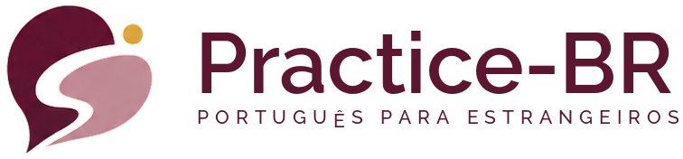
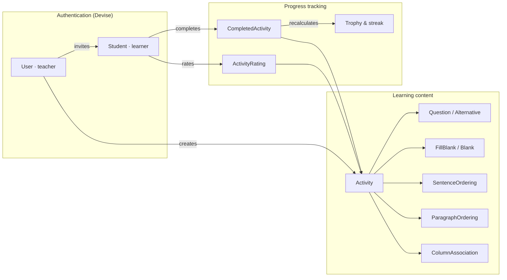

<p align="center">
  
</p>

<p align="center">
  <strong>A full-stack Rails application for learning French</strong><br>
  Designed by a former teacher, built by a developer — live in production, with real students.
</p>

<h3 align="center"><a href="https://github.com/DaisyOli/Practice-FR">Practice FR</a></h3>

<p align="center">
  <a href="https://github.com/DaisyOli/practice-fr/actions/workflows/ci.yml"></a>
  
  
  
  
  <a href="https://practicefr.com"></a>
</p>

<p align="center">
  🇬🇧 English · <a href="README.fr.md">🇫🇷 Français</a>
</p>

---

## The idea

**Practice FR** is a platform where French teachers build interactive activities (multiple choice, fill-in-the-blank, sentence/paragraph ordering, column matching) and track their students' progress — streaks, CEFR levels, and training attestations ready for OPCO / CPF funding files.

This isn't a portfolio toy: it's a **live production app** (Heroku, [practicefr.com](https://practicefr.com)) serving real teachers and real students, with everything that implies — timeout limits, async processing, rate limiting, health checks, admin audit logging.

## What makes this project interesting

### 🎮 Gamification with an actual concept, not just a progress bar
Every consecutive day of practice moves a student closer to a French-themed trophy — implemented as a real business rule in `Student#current_trophy`, not a generic gem:

`🎯 Beginner → 🥐 Croissant (3d) → 🥖 Baguette (7d) → 🧀 Fromage (14d) → 🍷 Wine (30d) → 🗼 Eiffel Tower (60d+)`

### 📜 Training attestations built for the French professional-training market
In France, a large share of adult language training is paid for by professional-training funds — the employer's **OPCO** or the learner's personal **CPF** training account — and funders require proof that the training hours actually happened. Practice FR handles this end to end: the teacher tags a student's funding track (OPCO / eCPF) right on the invitation, a dedicated badge follows the student across the app, and one click generates a **printable training attestation** whose hours come from measured practice time (activity start → completion, capped per attempt) rather than self-reporting. These records help teachers and training providers document learner
participation and provide supporting evidence for professionally funded training programs.

### 🏗️ A "franchise" architecture — one design system, two brands
This repo shares a **design contract** with its sibling app in Portuguese (Practice BR): identical CSS token names (`--brand`, `--ink`, `--paper`…), identical component anatomy, only the palette values differ. The golden rule — *never a raw hex in a view, always `var(--token)`* — is documented and enforced across the codebase (`docs/DESIGN_SYSTEM.md`). The payoff: a view written for one app runs on the other with zero structural changes.

### 📚 Exercise types are first-class models, not generic JSON blobs
Multiple choice, fill-in-the-blank, sentence/paragraph ordering, and column matching are each their own ActiveRecord model (`fill_blank.rb`, `sentence_ordering.rb`, `column_association.rb`…), with their own validations, display order, and nested controllers — not a catch-all `type` column.

### 🛡️ Built for production, not just "works on my machine"
- 25-question limit per activity plus **asynchronous batch processing** for large activities, with email notification on completion
- `Rack::Timeout` with dedicated middleware for heavy activity-related requests
- `Rack::Attack` for rate limiting
- A `/health` endpoint that actually checks PostgreSQL **and** Redis, not just a bare `200 OK`
- An admin panel with a real **audit log** (`AdminAuditLog`) for every sensitive action (account deletion, level changes…)

## Features

| | |
|---|---|
| 🔑 **Dual authentication** | Devise for teachers, Devise for students (`Student`), separate sessions and permissions |
| ✉️ **Email invitations** | `devise_invitable` — teachers invite, students accept and set their own password |
| 📈 **CEFR levels (A1 → C2)** | Cumulative access: a B1 student sees A1, A2 and B1 content |
| 🔥 **Streaks & trophies** | Daily tracking, best streak on record, motivational message in French |
| 📊 **Teacher dashboard** | Student roster, average score, last activity, training time |
| 📜 **Training attestations** | OPCO / eCPF badge per student + printable attestation, with hours computed from measured practice time — the proof French funding bodies require |
| ⭐ **Activity ratings** | Students rate the activities they complete |
| 🛠️ **Admin panel** | Cross-teacher overview plus a full action audit log |

## Architecture



## Tech stack

**Backend** — Ruby 3.3.5 · Rails 7.1 · PostgreSQL · Redis · Puma
**Frontend** — Tailwind CSS + DaisyUI 4 · Stimulus · Turbo · Importmap (progressive migration away from Bootstrap, no heavy JS framework)
**Auth** — Devise + Devise Invitable (two distinct authentication models)
**Resilience** — Rack::Attack · Rack::Timeout · Active Job (batch processing)
**Quality** — Minitest (models, controllers, integration, system), GitHub Actions CI (Postgres + Redis as services)
**Infra** — Docker / Docker Compose, deployed on Heroku

## Getting started

```bash
git clone git@github.com:DaisyOli/practice-fr.git
cd practice-fr
bundle install && yarn install

touch .env             # fill in the keys below
bin/rails db:create db:migrate db:seed
bin/dev                # runs Rails + the Tailwind build
```

Open `http://localhost:3000`.

<details>
<summary>Required environment variables (.env)</summary>

```bash
FRENCH_APP_DATABASE_PASSWORD=
SECRET_KEY_BASE=       # bundle exec rails secret
DEVISE_SECRET_KEY=     # bundle exec rails secret
GMAIL_USERNAME=
GMAIL_PASSWORD=
```
</details>

<details>
<summary>With Docker</summary>

```bash
docker-compose up
```
</details>

### Tests

```bash
bin/rails test              # full suite
bin/rails test test/models  # a specific folder
```

## The design system

`docs/DESIGN_SYSTEM.md` and `docs/design_system.html` document the full visual contract — typography, radii, button hierarchy, text scale — shared with the Portuguese sibling app. Practice FR's palette (*Bordeaux crème*) lives in a single file, `app/assets/stylesheets/_tokens.scss`: rebranding means changing that one file.

## About

Built by **Daisy Oliani** — former teacher turned developer, building the tools she wished she'd had in the classroom.

[LinkedIn](https://www.linkedin.com/in/daisy-oliani-487a6379/) · [GitHub](https://github.com/DaisyOli) · practicefrsite@gmail.com
